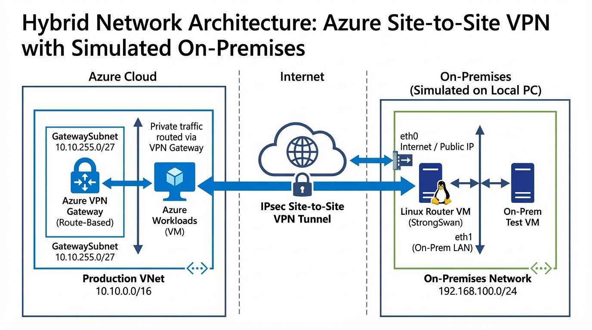

# Azure Hybrid Connectivity – Site-to-Site VPN with StrongSwan

## Overview
This project demonstrates the implementation of a Site-to-Site IPsec VPN between Microsoft Azure and an on-premises environment simulated locally.
The goal is to build real hybrid connectivity using production-like components and configurations, focusing on networking fundamentals rather than managed abstractions.

The project simulates a common enterprise scenario where an organization connects its on-premises network to Azure as part of a gradual cloud migration.

---

## Architecture

### High-level components
- Azure Virtual Network (10.10.0.0/16)
- Azure VPN Gateway (Route-Based)
- Local Network Gateway representing on-premises
- Linux router VM using StrongSwan (IKEv2)
- On-premises test VM for traffic validation

---

## Network Design

### Azure Side
- Virtual Network: `10.10.0.0/16`
- GatewaySubnet: `10.10.255.0/27`
- VPN Gateway:
  - Type: VPN
  - VPN type: Route-based
  - SKU: VpnGw1
  - Public IP: Standard / Static
- Connection:
  - Type: Site-to-Site (IPsec)
  - IKE version: IKEv2
  - Authentication: Pre-Shared Key (PSK)

### On-Premises Side (Simulated Locally)
- On-Prem LAN: `192.168.100.0/24`
- Router VM:
  - OS: Ubuntu 24.04 LTS
  - VPN software: StrongSwan
  - Interfaces:
    - WAN (NAT / Internet)
    - LAN (Internal Network)
- Test VM:
  - Used to validate traffic across the VPN tunnel

---

## VPN Configuration Summary

### IPsec Parameters
- Key Exchange: IKEv2
- Encryption: AES-256
- Integrity: SHA-256
- Diffie-Hellman Group: MODP 1024
- Tunnel type: Route-based

StrongSwan was configured using `/etc/ipsec.conf` and `/etc/ipsec.secrets`, matching Azure’s default IPsec/IKE policy.

---

## Validation and Testing

The VPN tunnel was successfully established and validated using real traffic.

### Evidence
- Azure VPN Connection status: **Connected**
- StrongSwan `ipsec statusall` showing `ESTABLISHED`
- ICMP traffic successfully crossing the tunnel from on-premises to Azure

Screenshots are included in the `screenshots/` directory as implementation evidence.

---

## Cost Management
The project was implemented with cost awareness in mind:
- The Azure VPN Gateway was created only for testing purposes
- After validation, the VPN Gateway and connection were deleted to avoid unnecessary charges

---

## Troubleshooting Highlights
During the implementation, several real-world issues were encountered and resolved, including:
- Netplan and cloud-init conflicts on Ubuntu
- Interface state vs connectivity interpretation
- Duplicate CHILD_SA messages in StrongSwan
- Correct service management (`strongswan-starter`)

Details are documented in the troubleshooting section.

---

## Key Takeaways
- Hands-on experience with hybrid networking in Azure
- Practical IPsec and IKEv2 configuration using StrongSwan
- Real troubleshooting of Linux networking and VPN behavior
- Clear understanding of Azure VPN Gateway architecture

---

## Next Steps
- Extend the design with Azure Hub-and-Spoke networking
- Implement centralized security (Azure Firewall)
- Replicate a similar hybrid VPN design in AWS for comparison
